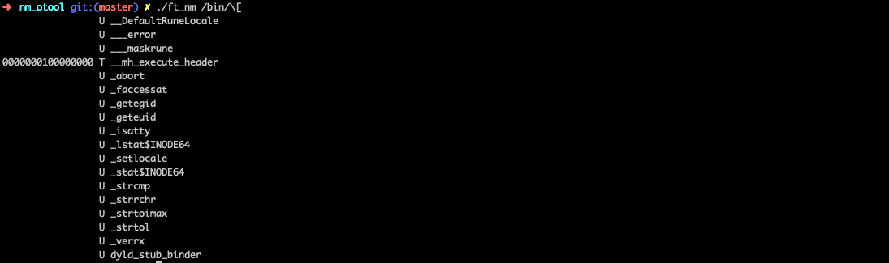
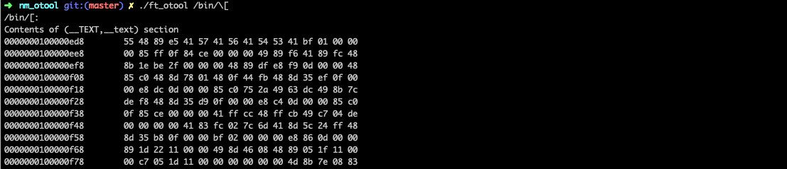

# nm otool

The objective of this project is to recode the `nm` binary (default behaviour) and the `otool` (only with option -t). This project allows us to explore how executable are formated in mac-os.

## nm

`ft_nm` takes a binary and retrieve the functions used in the binary from the symbol table. It can be used as shown below.
```
ft_nm <executable>
```


## otool

`ft_otool` takes a binary and retrieve the text section used in the binary (like `otool -t`). It can be used as shown below.
```
ft_nm <executable>
```


### Final mark (109/125)